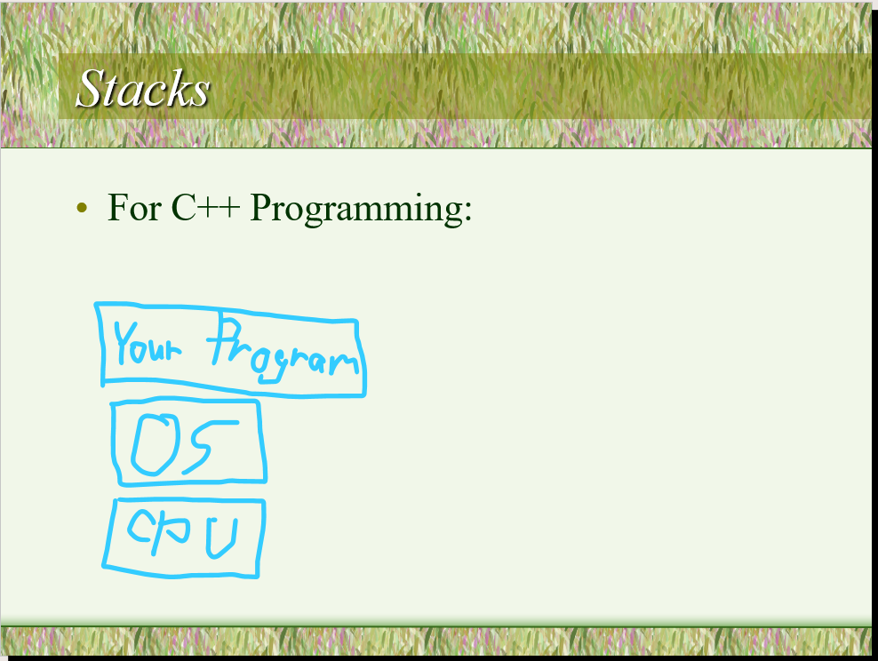
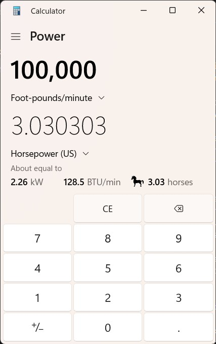
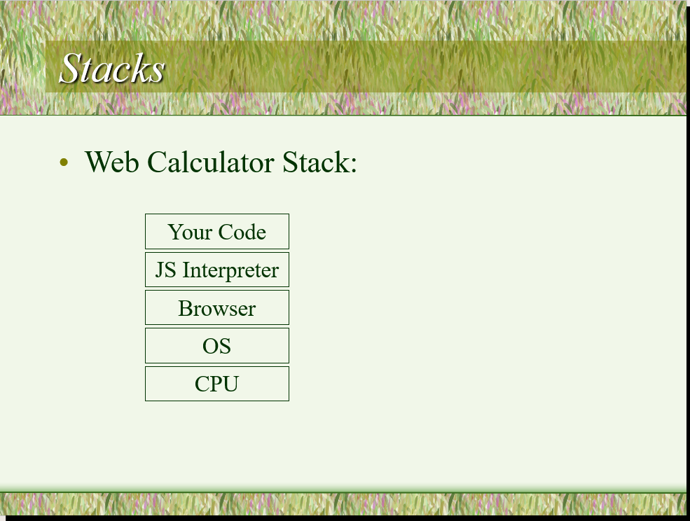
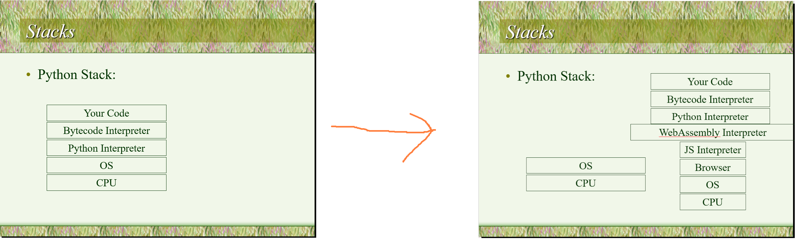

These are the notes and the accompanying PowerPoint I used to give a presentation about the prehistory of computing and the tech stacks it left us with to start off HacKSU at the beginning of the semester, Spring 2024. I threw it together in like 5 hours before the meeting, so coherence is not guaranteed. I don't know if anyone would ever want to try to give this as a presentation again, but I think it turned out kind of interesting.

---

The idea of "computers" was not always as obvious as it seems now, and it wasn't immediately clear what its consequences would be. It started innocuously enough; someone had the idea to build a machine that could do math automatically and precisely. Before we really had the ability to make machines that work that precisely, this was mostly an idea pursued by weirdos and eccentrics. The first person that we know of to conceive of a programmable digital computer, Charles Babbage, was also engaged in a lifelong war against street musicians. Victorian London was full of basically, buskers, playing instruments like barrel organs to get donations and liven up the place a little. Babbage hated them, publicly campaigned against them, and even got legislation passed against them. "I have developed... an unenviable celebrity," Babbage once [wrote](https://priceonomics.com/charles-babbages-fight-against-street-music/), "not by anything I have done, but simply by a determined resistance to the tyranny of the lowest mob, whose love, not of music, but of the most discordant noises, is so great that it insists upon enjoying it at all hours in every street."

There are a lot of weird stories about Charles Babbage. It's claimed that he was baked in an oven at 265° and lowered into Mt. Vesuvius to view the lava... I couldn't find a primary source for this, but it's on [these slides](https://www.cs.cmu.edu/~15292/assets/slides/02-BabbageAndHisInventions.pdf) from Carnegie Mellon, so it might be true. He wrote to the poet Tennyson, famous these days for poems like The Charge of the Light Brigade, to [correct](https://engines.egr.uh.edu/episode/879) what he perceived as inaccurate population statistics in one of his poems.

He and his computing devices were known in the intellectual society at the time - references to his projects show up in contemporary letters, and he got government funding for them eventually. But his war with the street musicians was also a pretty big deal, especially as his health declined and he eventually died. \[Read quotes from PowerPoint.] [His obituary](https://en.wikisource.org/wiki/The_Times/1871/Obituary/The_Late_Mr._Charles_Babbage,_F.R.S.) began by calling him an original thinker and well-known mathematician and then in the <ins>second sentence</ins> moves on to how he survived for almost 80 years "in spite of organ-grinding persecutors." So that was the life of Charles Babbage.

The thing is, hundreds of years later, computer science is still primarily the domain of eccentrics and weirdos. (I myself get annoyed by the type of music that's playing in coffee shops sometimes.) But now the whole world is controlled by the weird things they built. Let's examine some of this stuff. There's this concept of a "technology stack," which is basically: what systems developed by other people are you using to accomplish a given task? There are common stacks that you web developers may have heard of, which are basically a bunch of pieces of existing software that are known to work reasonably well together for web development, like the LAMP stack (Linux, Apache, MySQL, PHP) and the MERN stack (MongoDB, Express.js, React, Node.js). But I think this concept of a stack can actually be extended a little and used to analyze the practice of programming more broadly.

We think of stacks as consisting of layers of technology, where a lower layer exists to support the layers above it. So the classic lowest level of computing that we ever hopefully need to think about is the CPU. The CPU is basically a magic little box which electricity enters and exits in complicated and mysterious ways. CPUs are complicated and we probably don't want to know everything that's inside them. Modern CPUs are about this big, but if you could take all the electrical connections out of them and lay them out over a flat surface, they would stretch for miles and miles. But the idea is that it provides the ability to perform a bunch of complicated operations, mostly calculations involving numbers, if you know how to ask it. 

Then the next layer of this stack that programmers care about is probably the operating system. The operating system consists of a bunch of compiled machine code that basically exists to make requests of the CPU and the other physical hardware in your computer, and in turn provides the functionality of loading programs into memory, scheduling them to run, and communicating with things like network devices and your monitor to allow things to be displayed.

Then there's the normal programs that run on your computer, like I don't know, the calculator app. The calculator app consists of compiled machine code, which is a language that the CPU understands, and its machine code instructions get sent to the CPU by the operating system. And it also requests other things from the operating system as a result, like it says "please draw these numbers on the screen and let me know when the user clicks their mouse on them."



If you're programming C++, which is a classic programming language that the university we're in teaches, you're basically going to be hanging out at this level. Your code is going to be turned by a compiler into some machine code that gets sent to the CPU and then makes requests of the operating system. And that's great at all, but it's kind of basic. The operating system provides features that make it really easy for a program that you create to read and write plain text. Doing things with graphics is a little bit complicated and you pretty much need to bring in more layers to provide you with the ability to display graphics without, like, having to set the color of each pixel in a window individually, which is the most basic way to do graphics. Even the calculator app actually has another layer to its technology stack that I didn't mention; its code is partially written in C# and XAML, which access services from a layer called .NET that provides more tools to draw graphics to a screen than the operating system provides by default. Still, though, the calculator app contains a lot of code. [The code is published publicly](https://github.com/microsoft/calculator) on a website Microsoft owns called GitHub. So I can determine that it contains 26,647 lines of C++ and 13,152 lines of C#. Plus a bunch of other stuff that may or may not be partially auto-generated, I'm not sure. And it's a calculator. It's a pretty advanced calculator, it can apparently convert foot-pounds per minute to horsepower, but still. (It's great that it just says "horses.")



So that's like. A lot of code. But there are other ways to program, and most people use those. Let's take a look at my most trusted source for the tools that people are using for their hobbies and jobs, which is the [Stack Overflow Developer Survey](https://survey.stackoverflow.co/2023/#technology-most-popular-technologies). Here, we can see that most people end up using other languages than C++; 22% is not nothing, but it's not like a majority of developers use it.

At the top of the heap are HTML and JavaScript, which are basically the languages that are used in web development and the ones that provide the most tools that allow you to create graphical user interfaces for things. Remember, each layer in a technology stack provides services to the one above it, so roughly speaking, the more layers you have in your stack the more tools you're able to access, and you pick the stack that offers the most tools that fit what you want to do specifically.

Allow me to demonstrate. Remember, the calculator app in Windows had tens of thousands of lines of code. But using the stack: CPU, operating system, web browser, HTML renderer, and JavaScript just-in-time compiler, we can create a calculator whose source code is this:

```html
<style type="text/css">
   body {margin:4vmin auto; width:74vmin; background:#eee; font-size: 8vmin; font-family:sans-serif;}
   input, div { height:2em;  border-radius: 1em; font-size:1em;}
   input {width:6.8em; padding: 0 1em;  margin:0 0.4em 0.4em 0; text-align:right; border:none;}
   div {width:2em; background:#fff; border:none; margin:0 0.4em 0.4em 0; display:inline-block; text-align:center; line-height:2em;}
   div:active {background:red; color:white;}
   div:nth-child(5n + 2) { background:#4A90E2; color:white; margin-right:0;}
</style>
<input type="text"><div onclick="field.value = ''">C</div><br><div>7</div><div>8</div><div>9</div><div>÷</div><br><div>4</div><div>5</div><div>6</div><div>×</div><br><div>1</div><div>2</div><div>3</div><div>-</div><br><div>.</div><div>0</div><div onclick="field.value = eval(field.value.replace('÷', '/').replace('×', '*'))">=</div><div>+</div>
<script type="text/javascript">
   var field = document.querySelector('input');
   document.querySelectorAll('div').forEach(function(div) {
     if (!div.onclick) div.onclick = function(div) { field.value += this.innerText; }
   });
</script>
```

With a little modification to make sure special characters are indicated properly, the source code literally fits in the URL bar of your browser.

```
data:text/html;charset=UTF-8,<head><style type=%22text/css%22> body {margin:4vmin auto; width:74vmin; background:%23eee; font-size: 8vmin; font-family:sans-serif;} input, div { height:2em;border-radius: 1em; font-size:1em;} input {width:6.8em; padding: 0 1em;margin:0 0.4em 0.4em 0; text-align:right; border:none;} div {width:2em; background:%23fff; border:none; margin:0 0.4em 0.4em 0; display:inline-block; text-align:center; line-height:2em;} div:active {background:red; color:white;} div:nth-child(5n + 2) { background:%234A90E2; color:white; margin-right:0;} </style> </head><body><input type=%22text%22><div onclick=%22field.value = %27%27%22>C</div><br><div>7</div><div>8</div><div>9</div><div>÷</div><br><div>4</div><div>5</div><div>6</div><div>×</div><br><div>1</div><div>2</div><div>3</div><div>-</div><br><div>.</div><div>0</div><div onclick=%22field.value = eval(field.value.replace(%27÷%27, %27/%27).replace(%27×%27, %27*%27))%22>=</div><div>+</div> <script type=%22text/javascript%22> var field = document.querySelector(%27input%27); document.querySelectorAll(%27div%27).forEach(function(div) {if (!div.onclick) div.onclick = function(div) { field.value += this.innerText; } }); </script></body>
```


There's actually a website called [itty.bitty.site](https://itty.bitty.site) that exists so you can make a tiny little web page and it compresses it and puts it in a URL so that you can just share the site by sharing the URL. The code fits in the URL. This isn't normally how we do things - usually a URL is basically just the name of a webpage, not the entire code, but this shows what you can do with a little if you leverage all the tools that come with a deep technology stack. Specifically, HTML (and CSS) make it easy to create graphical user interface elements like buttons and JavaScript makes it really easy to make those buttons reactive and, like, evaluate arbitrary math expressions.



Side note: Discord is using those technologies inside its app in a browser without telling you. These technologies are everywhere.

Now, is this a fair comparison? No. The itty bitty calculator app here does not convert foot-pounds to horsepower. It can't handle arbitrarily large numbers like the Windows calculator can. It's just itty bitty. But, this gives you the idea of the vibe of these two different kind of technology stack. The basic CPU + OS + maybe .NET stack is the kind of thing you use if you're Microsoft, and you want to pay a dozen engineers 6 figures for a year to make a calculator that can do math in units of horses. The web development stack is more for if you're just a little guy and you want to get things done quickly. Obviously, things get more complicated in real projects where people like, log in and check their fantasy football league or whatever normal people do online, both in terms of the stack you'll use and the code you write that uses it. But this is the basic idea is: C++ takes a lot of code to do a little; loftier stacks like the ones that leverage the browser and a JavaScript interpreter take a little code to do a lot.

Now, there are tradeoffs. Code that's written in JavaScript will generally run slower than code that does the same thing that's written in C++. This is kind of about the design of the language itself, but on a more basic, practical level, it's really about all the complicated stuff that has to happen to make JavaScript code run at all. Languages are just languages and are not inherently slow, but the Rube Goldberg machines that it takes to execute code in them can be; CPUs, operating systems, browsers, and JavaScript engines are all complicated, and they all get involved in these things. But, if you're not primarily prioritizing how fast your program will run, the speed of development with a higher level language is generally worth it.

The bigger tradeoff is this: you're going to be using more systems created by Charles Babbage.

Okay, maybe not literally. But computing is the domain of eccentrics and weirdos, and the taller your technology stack is, the more systems are going to be responsible for getting your code to run, and the more ideas you're going to have to use that someone suspiciously like Charles Babbage came up with. (Also, yes literally, the preserved brain of Charles Babbage has written a lot more JavaScript frameworks than you might think, that's why there are so many.)

Python is another language that has a taller stack (see slide) and gives you more tools to work with. Typically, to run code written in Python, you download a Python interpreter that takes the code you wrote and turns it into bytecode, which is a special kind of code that's a little simpler than the stuff we write, and then another part of the program you downloaded takes the bytecode and figures out what to request that the CPU and operating system do as a result.

This sounds simple enough, but in practice installing the Python interpreter that does that stuff is kind of hard. It's very typical for someone to end up with multiple versions of it on their computer that do subtly different things and not be able to figure out what version of the interpreter is working at any given time. What if... what if we didn't have to install Python to run Python code?

Well... we already have a way to run programs without installing them. Your browser does that all the time. What if we could just take the Python stack and put it on top of the browser stack?

\[This is where I started editing the PowerPoint to construct a new "stack" of technologies, live]



The standard Python interpreter is written in C. Now, C is just a language; there's a standard stack that supports it, but we can come up with an alternate one. C can be compiled to an alternate type of code called WebAssembly, which can run in a browser. We can add a layer to our stack called WASI that provides the services that C expects the operating system to provide. And then we can run Python code directly [in our browser](https://antonz.org/in-browser-code-playgrounds/), which is not where it would normally run.

Now, there are obvious next steps to pursue. You can keep stacking stacks on top of each other. But I leave that to your imagination. The overall lesson is this: lower-level languages like C and C++ provide a basis for a lot of other computation that you might want to do. But you can build higher. As you approach the heavens, you will start speaking in abstract and multitudinous tongues and your people will be scattered to the ends of the earth. But if you complete this Tower of Babel, you will become a God.


### A side note on AI:

In a very different era to Charles Babbage's, Alan Turning worked to decode secret messages using computers during WWII. As you probably know, he originated the idea of the thing now called the Turing Test, which very roughly has passed into popular culture as "if a computer can hold a conversation with you without you realizing it's not a human but in fact is a computer, then that computer can be said to be intelligent." The Turing test was first described in an article called ["Computing Machinery and Intelligence"](https://academic.oup.com/mind/article/LIX/236/433/986238) in 1950, and it's a really approachable and well-written essay.

I have a take on where the colloquial definition of the term AI seems to come from: the two major practical, consumer-facing types of computer program that have been constantly referred to as AI in the past 20 years are chatbots like ChatGPT and, much more prominently for much longer, video game opponents that are controlled by a computer but are programmed to act like humans. The only commonality between chat bots and enemy AI in video games is that they copy humans. And that makes them "intelligent." But Alan Turing actually takes the other side of this debate right away, and asks, is this test fair? After all, no human could pretend to be a computer. We can't do math fast enough. So what right have we to expect computers to be able to imitate humans?

But even if it's unfair, he makes the claim that if a machine ever did pass this test, it would be notable, and thus it's worth thinking about it. And so he goes back to the human perspective, and proposes that the simplest way to create a learning machine would be to create a child computer. After all, children's brains and minds are theoretically simpler than adults, and a child computer could then just learn. He writes, "It will not be possible to apply exactly the same teaching process to the machine as to a normal child. It will not, for instance, be provided with legs, so that it could not be asked to go out and fill the coal scuttle. Possibly it might not have eyes. But however well these deficiencies might be overcome by clever engineering, one could not send the creature to school without the other children making excessive fun of it." Alan Turing, in the same article as proposing the Turing test, was also one of the first computer scientists to propose computers that are weird little guys.
